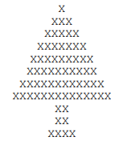

# Semana 1:

## Questão 1:
Implemente um programa que escreve na tela a frase "Hello World".

## Questão 2:
A catraca do Restaurante Universitário (RU) foi programada para liberar a entrada de um aluno avaliando uma única expressão lógica.
A entrada é liberada se o aluno for bolsista (não paga nada) **OU** se ele tiver créditos suficientes na carteirinha **E** o restaurante estiver no horário de funcionamento.
Escreva um programa que leia esses dados e imprima $1$ se a entrada for permitida ou $0$ caso contrário. Não é permitido usar estruturas condicionais.

## Questão 3:
Implemente um programa que desenhe um "pinheiro" na tela, similar ao abaixo. Enriqueça o desenho com outros caracteres, simulando enfeites.  
 

## Questão 4:
Faça um programa que leia um número inteiro e imprima o quadrado desse número e o correspondente a sua quinta parte.

## Questão 5:
Os pontos $(x,y)$ que pertencem à figura $H$ (abaixo) são tais que $x \geq 0$, $y \geq 0$ e $x^2 + y^2 \leq 1$.  
Leia as coordenadas de um único ponto. O programa deve imprimir 1 se estiver dentro de $H$ e $0$ se estiver fora.  
 

## Questão 6:
Um professor resolve fazer na sua disciplina três avaliações com pesos diferentes. Faça um algoritmo que receba três notas e seus respectivos pesos, calcule e mostre a média ponderada dessas notas.
- Entradas:
  - Três números reais representando as notas nas avaliações
  - Três números reais correspondendo aos pesos das avaliações
- Saídas:
  - Número real correspondente a média ponderada das notas
 
 ## Questão 7:
Crie um programa que recebe dois valores e depois troca os valores entre eles.

## Questão 8:
Faça um programa que receba dois números e exiba a soma, subtração, multiplicação e divisão entre eles.

## Questão 9:
Receba um número de horas e converta para segundos.

## Questão 10:
Faça um programa que receba um nome, idade e curso e exiba no formato: "Olá, **[nome]**! Você tem **[idade]** anos e faz **[curso]**!"

⚠️ ATENÇÃO:

O objetivo desta primeira semana é focar nos fundamentos lógicos de **entrada, processamento e saída** de dados. 

Portanto, a resolução dos exercícios **deve conter apenas código sequencial**. 

**Não é permitido o uso de:**
* Estruturas de decisão (`if`, `else`, `switch`, `case`)
* Estruturas de repetição (`for`, `while`, `do-while`)
* Vetores/Arrays ou Coleções