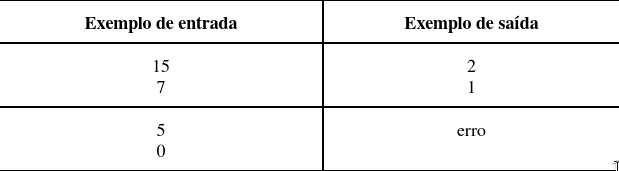

# Semana 2:

⚠️ ATENÇÃO:

O objetivo desta segunda semana é focar nos fundamentos da estrutura de decisão.

Não é permitido o uso de:
- Estruturas de repetição (for, while, do-while)
- Vetores/Arrays ou Coleções

## Questão 1:  
Faça um programa que leia dois números e mostre qual deles é o maior.

## Questão 2:  
Faça um programa que computa os resultados de uma divisão inteira. Dados um dividendo e um divisor, o programa deve informar o quociente e o resto. Caso não seja possível fazer a divisão, o programa deve escrever erro (letras minúsculas).

Entradas:
- Um número inteiro que representa o dividendo (numerador).
- Um número inteiro que representa o divisor (denominador).

Saídas:
- O quociente da divisão.
- O resto da divisão.

Exemplo:

